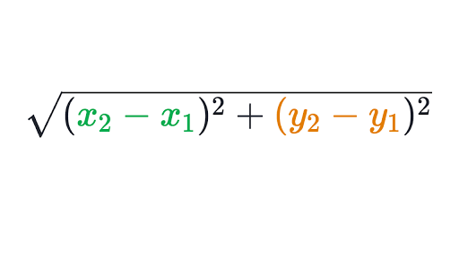

# Distance Traveled: Instructions  

Football players run a great deal during a game. How far exactly? Your task is to write a pair of functions to help find out.

A player's path of travel will be given as a list of points, like this:

```python
[
  (1.0, 3.0),
  (1.2, 3.2),
  (1.4, 3.2),
  (1.6, 2.8),
  (1.8, 3.0),
  (2.2, 3.0)
]
```

You will write a function that takes in such a list, and counts up how far the player went overall.

## Step 1: The Distance Formula

Write a function called `distance` that takes in two points and returns the distance between them.

Each point will be a tuple like `(1.2, 3.0)` or `(-5.0, 1.5)`.

The distance between two points is given by the distance formula:




> A **tuple** is like a list, but it can only have a fixed number of items. So, you can't add more items to a tuple. You can create a tuple using parenthesis, and can access the items using the square brackets, like an array:
```python
tuple = (45.6, 78.1)
print(tuple[0]) # 45.6
print(tuple[1]) # 78.1
```


## Step 2: Using the distance formula on a list of points

Now that you have a function that finds the distance between two points, you can use it to find the total distance of the points in the list.

Write a function called `total_distance` that takes in a list of points. It should use the other function you wrote to find the distance between each pair of points, and add up all the intermediate distances. It should return the total distance.

## Hints and Tips

* You can import the math library with `import math`
* Squaring a number in python is `x ** 2`. To take the square root, import the math library and use `math.sqrt`.
* You can access the elements of a tuple just like a list, so: `point[0]` for the x value and `point[1]` for the y value.
* Think carefully about how to loop over pairs of points.